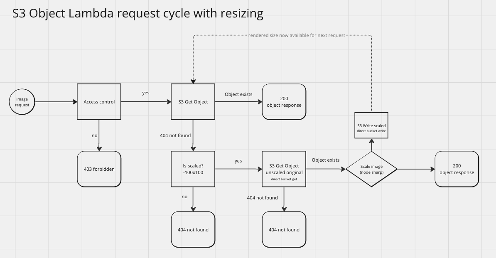

# Image resizing

Where WordPress normally generates all scaled derivates during file upload, this application provides a way to serve images at specific sizes without having to generate all of them in advance. This can result in significant storage and processing savings for WordPress sites with a large number of image sizes defined, but only a few of those sizes are used in the site. Only sizes that are actually requested will be generated and stored in the bucket.

It also allows for original media to be stored separately from the scaled derivates, making it easier to manage very large media libraries. For example, when cloning sites for development or testing, the original media can be copied to the new site without having to copy all of the scaled versions. The scaled versions will be automatically generated when the media is requested.

Custom crop controls are available with the image scaling, either through GET parameters to the image request or through custom image sizes defined in a WordPress theme.

The access controls are applied based on the path of the file, not the file name, so access controls are applied consistently across the original and any scaled versions of the file.

The logic of the image scaling handler and how it relates to access control is described in the following diagram:


## WordPress compatible custom image sizes

WordPress themes can define custom image sizes using the `add_image_size()` function. This function takes a `crop` parameter that determines if portions of the image should be removed to fit the custom size. The BU Media S3 WordPress plugin has a wp-cli command that can be used to push the custom image sizes defined in the theme to the DynamoDB table. These records use a primary key based on the site url and look like this: `SIZES#example.bu.edu/example-site`.

The `getOrCreateObject()` function uses the `lookupCustomCrop()` function to load any custom sizes that may be defined for the site in the DynamoDB table. If there is a size that matches the dimensions of the requested image and that size has custom crop settings, then that crop parameter is added to the rewritten file name in S3. It is also passed to the `resizeAndSave()` function which passes it to the `sharp` library to perform the crop.

By adding the crop parameter to the name of the object in S3, crop factors can change without causing a file name conflict.

## Custom Crop Parameters

In addition to crop parameters defined in WordPress themes, custom crop parameters can be added as GET parameters to the URL. For example, the following URL will crop the left part of an image:

```text
https://example.bu.edu/example-site/files/2024/01/16/picture-800x300.jpg?resize-position=top
```

Currently only top, bottom, left, right are accepted as resize-position options

## References

- [Developer reference on add_image size() and the crop parameter](https://developer.wordpress.org/reference/functions/add_image_size/)
- [Sharp library resize position options](https://sharp.pixelplumbing.com/api-resize)
