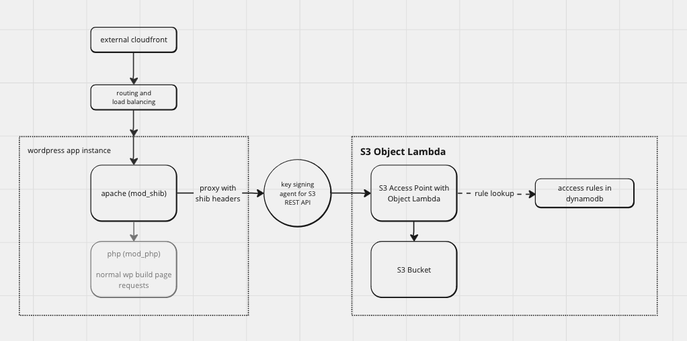

# BU Protected S3 Object Lambda

This AWS Lambda application, developed using the [Serverless Application Model (SAM)](https://aws.amazon.com/serverless/sam/), is designed to dynamically serve public and protected media files from an S3 bucket. It uses an S3 Object Lambda Access Point to apply access control protections and deliver objects from the bucket based on user session data and network location. It also provides WordPress compatible image resizing on demand using the [sharp](https://www.npmjs.com/package/sharp) library.

At Boston University, it is integrated with WordPress to provide media library services for the [BU WordPress Service](https://www.bu.edu/tech/services/cccs/websites/www/wordpress/).

## Contents

- [Protected media](#protected-media)
- [Image resizing](#image-resizing)
- [S3 Object Lambda function](#s3-object-lambda-function)
- [Deployment](#deployment)
- [BU production deployment](#bu-production-deployment)
- [Testing](#testing)
- [Troubleshooting](#troubleshooting)
- [References](#references)

## Additional Documentation

There are additional documents that describe the application in more detail available in the [docs](./docs) directory:

- [Protected media details](./docs/protected-media.md)
- [X-Forwarded-Host Header details](./docs/x-forwarded-host-header.md)
- [Image resizing details](./docs/image-resizing.md)
- [Lambda function details](./docs/lambda-function-description.md)

## Protected media

This AWS Lambda application provides robust protection for media files stored in an S3 bucket. It uses an S3 Object Lambda Access Point to control access to the media files based on user session data and network location. This ensures that only authorized users can access protected media files according to their login session. The access control rules are defined in a DynamoDB table, allowing for flexible and dynamic access control configurations. This feature is particularly useful for applications that need to serve sensitive media files, such as private documents, images, or videos, to authenticated users. Using this application, public and private media can be safely stored and served from the same S3 bucket.

The Lambda function relies on custom headers in the incoming request event to determine the user session data and network location.

More detail about access controls is availeble in the **[Protected Media](./docs/protected-media.md)** documentation.

### Use as WordPress media library

At Boston University, this application is used to serve media files from the WordPress media library in concert with a custom WordPress plugin which supplies the access rules to the DynamoDB table.  Login session data is provided by a Shibboleth session connected to the WordPress implementation. There is a routing rule that proxies all requests for media files to the S3 Object Lambda Access Point. The custom login headers are added by mod_shib based on any Shibboleth login session associated with the request.

The S3 Object Lambda an effective way to apply access protections but has the limition of only being accessible through a valid AWS v4 signed request. In order to provide a public interface, the proxied media requests are first sent to an instance of an [S3 sig-v4 proxy container]( https://github.com/awslabs/aws-sigv4-proxy).

The Lambda also accomodates multi-site and multi-network WordPress installations by using the X-Forwarded-Host header to determine the path of the S3 object that is requested by the user. More detail is available in the **[Using the X-Forwarded-Host Header](./docs/x-forwarded-host-header.md)** documentation.

This diagram describes the flow of a request for a protected media file:



## Image resizing

The Lambda function also provides image resizing on demand using the [sharp](https://www.npmjs.com/package/sharp) library. This feature is designed to integrate with the generated media sizes in the WordPress media library. When a user requests a media file with a specific size, the Lambda function checks if the file exists in the bucket. If it doesn't exist, the Lambda function creates the sized version of the file and stores it in the bucket. This feature is particularly useful for applications that need to serve images at specific sizes, such as a responsive web application. Using this application, images can be stored in the media library at their original size and sized versions can be created on demand and stored separately.

More detail about image resizing is available in the **[Image Resizing documentation](./docs/image-resizing.md)**.

## S3 Object Lambda function

The SAM template defines an `ObjectLambdaFunction` which leverages the [AWS S3 Object Lambda feature](https://aws.amazon.com/s3/features/object-lambda/). This AWS service allows you to add your own code to S3 GET requests to modify and process data as it is returned to an application. In this case, the `ObjectLambdaFunction` adds access restrictions and resizing features to the data returned by the S3 REST API.

The access restrictions ensure that only authorized users can access specific media files, while the resizing feature dynamically resizes images on demand. This is done without the need to store multiple sizes of each image, saving storage space and making the management of large media libraries more efficient.

More detail about the Lambda function is available in the **[Lambda Function description](./docs/lambda-function-description.md)** documentation.

## Deployment

The application is defined as a [AWS Serverless Application Model (SAM)](https://aws.amazon.com/serverless/sam/) template and can be generally deployed with the standard SAM CLI deploy sequence:

```bash
sam build -u
sam deploy --guided
```

The SAM template outputs several details of the deployment, including the name of the S3 bucket and the name of the S3 Object Lambda Access Point. It also contains a reference to the secret in AWS Secrets Manager that contains an access key that can be used with the S3 sig-v4 proxy container. This access key can also be used with the [Human Made S3 Uploads plugin](https://github.com/humanmade/S3-Uploads) to provide WordPress with upload access to the bucket.

### WordPress integration

Once the DynamoDB exists, the credential from the AWS Secrets Manager secret can be added to the WordPress configuration. Once the credential is added, the BU Access Control plugin has a wp-cli command that can be used to push the access rules to the DynamoDB table. The command is:

```bash
wp access network-update-dynamodb
```

### BU production deployment

The parameters of the BU production deployment are in the `samconfig.toml` file under the "prod" stanza.

Deployments are handled automatically by a Github Action that runs a `sam build` and `sam deploy` with the `prod` configuration when a commit is made to the `main` branch. More details about the Github Action are available in the **[Continuous integration/deployment (CI/CD)](./docs/cicd.md)** documentation.

## Testing

The package includes a suite of unit tests that can be run using the following command:

```bash
npm test
```

The tests use the [vitest](https://vitest.dev/) framework and the [aws-sdk-mock](https://www.npmjs.com/package/aws-sdk-mock) library to mock the AWS SDK. Each .js file has a corresponding .test.js file that contains the unit tests for that module. The tests contain mock values for various services and can be used to step debug through an example request during development.

## Troubleshooting

On first deployment, the PROTECTED_SITES record in the DynamoDB table will not yet exist. This will cause the Lambda function to return a 403 Forbidden response for all requests. The PROTECTED_SITES record can be empty, but it must exist in order for the Lambda function to work correctly.

## References

* [Introducing Amazon S3 Object Lambda – Use Your Code to Process Data as It Is Being Retrieved from S3](https://aws.amazon.com/blogs/aws/introducing-amazon-s3-object-lambda-use-your-code-to-process-data-as-it-is-being-retrieved-from-s3/)
* [Amazon S3 Object Lambda Developer Guide](https://docs.aws.amazon.com/AmazonS3/latest/userguide/transforming-objects.html)
